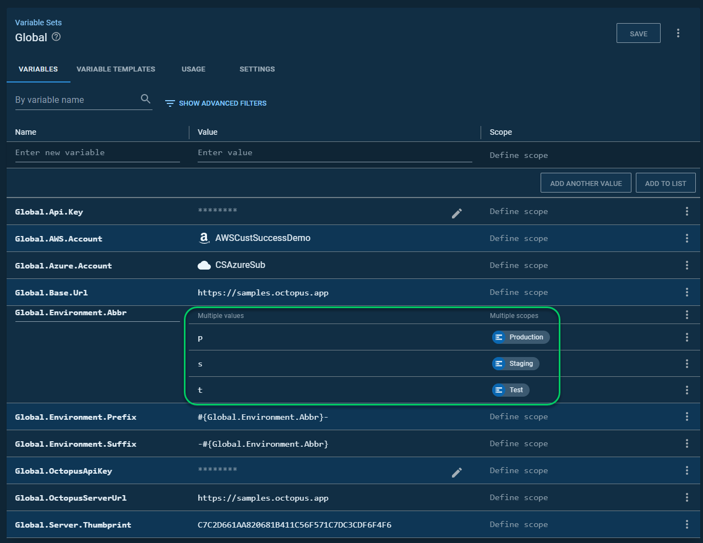
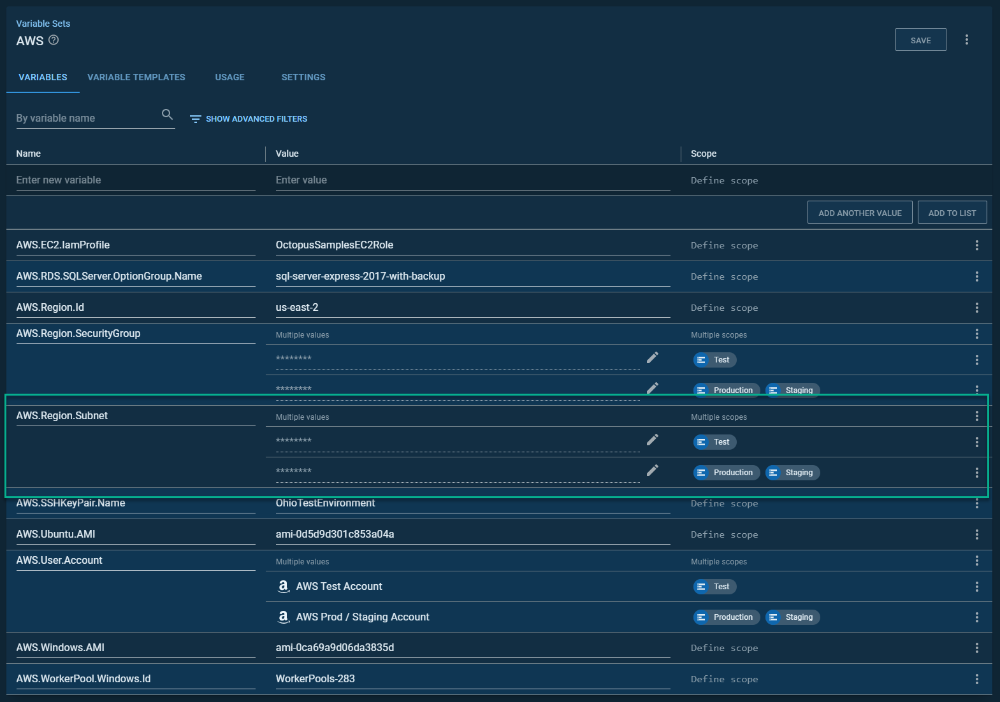
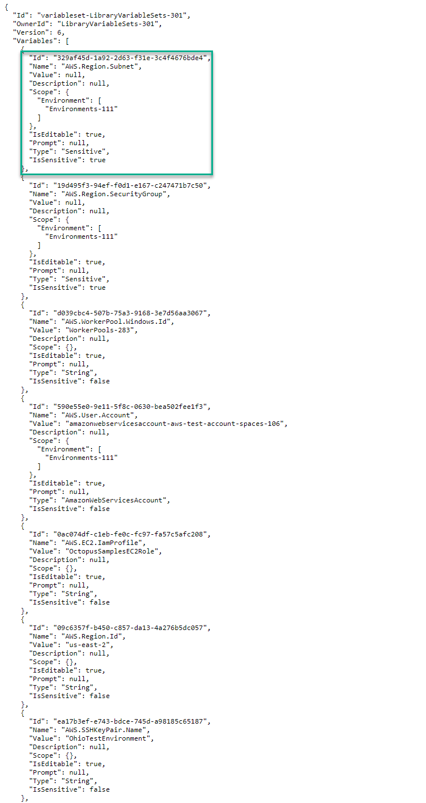
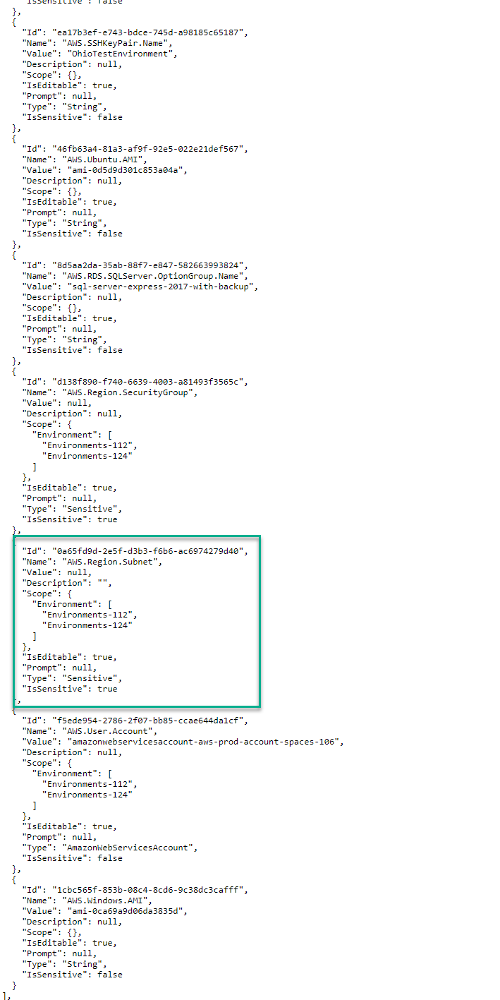

# Space Cloner
PowerShell script to help you clone a space using the Octopus Deploy Restful API.

# This cloning process is provided as is
This script was developed internally for the Octopus Advisory Team at Octopus Deploy to solve specific use cases we encounter each day.  We are sharing this script to help other users of Octopus Deploy.  To cover as many use cases as we run into as possible, the script has a set of generic comparisons in place.  It matches by name, order is tracked via a simple index, etc.  We work in Octopus all day every day.  As such, we are okay with a script that accomplishes 80-90% of a clone, and then spending a bit of time doing some manual work. 

> **Note:** Owing to the "as is" nature of this script, **Octopus Deploy does not provide any support for this via our support channels.**

This repository is [licensed](license) under the Apache license.  It is possible for the script to work for your use cases without modification.  However, it is impossible for us to write a script that matches every specific use case.  For example, you might store a number of your variables in a key store, with Octopus storing the credentials.  You could update the script so when it comes across a specific variable name the credentials are inserted into the variable value instead of pulling from the source instance.  

As such, we encourage you to fork it, test it out on an empty space or empty instance, look at the results and modify the script to meet your needs.  If you feel your change can benefit the community, please submit a pull request!

## Issues and Feature Requests

Issues, bugs, and feature requests will not be accepted.  As stated earlier, this repository is [licensed](license) under the Apache license.  You are free to fork the repository and fix any issues or add any features you think is useful.

The Octopus Advisory Team plans on keeping this script up to date with the latest version of Octopus Deploy.  If you do fork this repo, you might want to keep up to date on the latest changes.

## Pull Requests

We do accept Pull Requests on this repository.  See [Contributing guidelines](docs/Contributing.md).

## Tested Octopus Deploy Versions

This script has been tested against the following versions of Octopus Deploy:

- `2020.1.x`
- `2020.2.x`
- `2020.3.x`
- `2020.4.x`
- `2020.5.x`

It should work with `3.4.x`+ release of Octopus Deploy.  The script will run some version checks to ensure it doesn't call the wrong API endpoint.  There is a far better chance the script will work using a `2020.x` release of Octopus Deploy.

The source instance and the destination instance **must** be running the same major/minor (2020.1, 2020.2) release.  The script will check the version of the source instance and destination instance to ensure this rule is met.

# Just Get Me Going!

This repository contains multiple scripts:

- [CloneSpace.ps1](docs/CloneSpaceParameterReference.md) - The script to clone a set of items from space to another.
- [CloneSpaceProject.ps1](docs/CloneSpaceProjectParameterReference.md) - Will perform a reverse lookup and determine all the items it needs to clone for you.
- [CloneLibraryVariableSet.ps1](docs/CloneLibraryVariableSetParameterReference.md) - To be used when you want to copy a library variable set in the same space or different spaces.
- [ProjectSyncer.ps1](docs/ProjectSyncerParameterReference) - Will sync a parent project with 1 to N child projects in the same space on the same instance.

The fastest way to get started is to run this command.  It will clone everything in a space for you.

```PowerShell
CloneSpaceProject.ps1 -SourceOctopusUrl "https://samples.octopus.app" `
    -SourceOctopusApiKey "SOME KEY" `
    -SourceSpaceName "Target - SQL Server" `
    -DestinationOctopusUrl "https://samples.octopus.app" `
    -DestinationOctopusApiKey "My Key" `
    -DestinationSpaceName "Redgate Space" `    
    -ProjectsToClone "all"
```
**Note**: The destination space should be created before running the clone scripts. 

# Use cases
This script was written to cover the following use cases.

- As a user, I want to split my one massive default space into [multiple spaces on the same instance](docs/UseCase-BreakUpSpace.md).
- As a user, I have two Octopus Deploy instances.  One for dev/test deployments.  Another for staging/prod deployments.  I have the [same set of projects I want to keep in sync](docs/UseCase-KeepInstancesInSync.md).
- As a user, I want to clone a set of projects to a test instance to [verify an upgrade](docs/UseCase-CopyToTestInstance.md).
- As a user, I have a set of "parent" projects.  I clone from that project when I need to create a new project.  However, when the process on the "parent" project is updated, I would like to [update the existing "child" projects](docs/UseCase-ParentChildProjects.md).
- As a user, I would like to copy my projects from [self-hosted Octopus to Octopus Cloud](docs/UseCase-MigrateFromSelfHostedToCloud.md).
- As a user, I would like to [create a copy an existing variable set in the same space](docs/UseCase-CopyLibraryVariableSet.md).

## Possible but not recommended
- As a user, I want to merge multiple Octopus Deploy instances into the same space on a new instance.  That scenario, merging multiple disparate instances into one massive space, is not recommended.  The chance of overwriting something meaningful is very high.  Just like steering a car with your knees, while possible, it is not recommended.

# How the space cloner workers
Please see the [how it works page](docs/HowItWorks.md).

# Sensitive variables
Please see the page [sensitive variables](docs/SensitiveVariables.md) to see how sensitive variables are handled.

# Debugging and logging
Please see the [debugging and logging page](docs/Debugging.md).

# Reference
Please see [parameter reference page](docs/ParameterReference.md).

# Examples
Please see the [example page](docs/Examples.md).

# FAQ
Below are questions and answers to common questions we've gotten about this project.

### Why was this script created?
The Octopus Advisory Team at Octopus Deploy team developed this script.  We use it to clone items for our [samples instance](https://samples.octopus.app).

### Can I use this to migrate from self-hosted to the cloud?
Yes.  However, this script is not a full migration.  It will jump-start your migration.  This script hits the API, meaning it won't have access to your sensitive variables.  it will not clone releases or deployments.  See the [how it works](docs/HowItWorks.md) page for details on what it will and won't clone.  

### Is this the space migration / self-hosted to Octopus Cloud migrator tool that has been teased in the past?
No.  It was designed for specific use cases, and the limits placed on it were intentional.  For example, it can't access your Master Key, and without that, it cannot decrypt your sensitive data.  It should get you 80-90% of the way there.  You are free to fork this repo to modify the scripts to help get you another 5% of the way there.   

### Can I use this script to migrate from 2018.10 to 2020.2?
By default, no.  The script compares the major and minor versions of the source and destination.  

**Unless the source and destination [major].[minor] versions are the same; the script will not proceed.**

That can be overridden by setting the parameter `IgnoreVersionCheckResult` to `true`.  That should only be set to `true` when cloning to test spaces or test instances.  Setting it to `true` when cloning to production instances is asking for trouble.  This parameter was added to make it easier for the Octopus Advisory Team to set up test instances of Octopus Deploy with EAP versions.

### What permissions should the users tied to the API keys have?
For the source instance, a user with read-only permissions to all objects copied is required.  It will never write anything back to the source.

For the destination instance, we recommend a user with `Space Manager` or higher.  You can go through and lock down permissions as you see fit, but `Space Manager` will get you going.

### Can I use this in an Octopus Deploy runbook?
Yes!  It is a PowerShell script.  It calls the APIs, so you should be fine in using it in an Octopus Deploy runbook.

### Why doesn't this script create the destination space?
Honestly, it's a security concern.  There are two built-in roles that provide the space create permission, `System Manager` and `System Administrator`.  We recommend using the API key of a [service account user](https://octopus.com/docs/security/users-and-teams/service-accounts) when running the script.  That service account user would either need to be added to `Octopus Managers` or `Octopus Administrators` teams.  That user would also have permissions to create users and update other settings on your instance.  We want you to feel comfortable using the script as-is.  Requiring elevated permissions is a concern, and it isn't something we felt good about asking our users to do.

Yes, you can create a custom role and assign the service account user to that role.  The goal of this script is it should "just work" with a minimal amount of configuration on your end.  Once you start diving into permissions and custom roles, it is going to be much harder to get working.  

### Does the script clone users, teams, and roles?
This script does _**NOT**_ clone users, roles, or system teams.  You can tell it to clone space-specific teams only. 

When it attempts to set up scoping for a team, it will skip any missing roles on the destination.  

Teams that are created have the external groups cleared.  

In other words, the clone team functionality will only assign existing users and roles to space teams.  This is an intentional decision, as creating anything new might compromise your security on the destination instance.  

### It doesn't appear like all my variables were cloned, what gives?

The cloner defaults to leaving variables on the destination instance as-is.  

Some use cases can trip you up.  If you find variables aren't being cloned correctly (and they are not sensitive variables), the recommendation is to delete the variables you want cloned in the destination instance and let the default behavior take over.  The cloner does the best it can, but it cannot account for odd and/or random configurations.

#### New scoped values
On your source space you have the variable `Global.Environment.Abbr` and it has 4 unique values, one for each environment.


On your destination space, you have the same variable set with the following values:



By default the cloner will leave the the destination as-is.  You have to add the parameter `AddAdditionalVariableValuesOnExistingVariableSets` and set it to `$true` to add that missing value.

**The default for the paramter `AddAdditionalVariableValuesOnExistingVariableSets` is `$false`.**

#### Existing Values
On your source space you have the variable `Testing.Variable` and it is set to `Test`.  On the destination instance that same variable exists and it is set to `Super Test`.  By default the cloner will leave the value on the destination instance as `Super Test`.  To update that value to match the source you will have to set the parameter `OverwriteExistingVariables` to `$true`.  

**The default for the paramter `OverwriteExistingVariables` is `$false`.**

#### Variable Ordering

Consider this variable set with the variable `AWS.Region.Subnet`.  It has two values.  



What is tricky is the variables are not stored together in the database.  Rather they are two separate entities.

The first value is the first item returned in the variable set array.



The second value doesn't appear until the end of the variable set array.

  

The cloner will match the variable by name, then by scoping.  