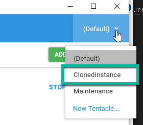

# Use Case: Point a Tentacle to Two Octopus Deploy Instances
A tentacle establishes a two-way trust with an Octopus Deploy server by exchanging certificate thumbprints.  This is a security feature to ensure a tentacle won't accept commands from servers it doesn't trust, nor will the server accept connections from tentacles it doesn't trust.  

There are a number of use cases where it makes sense to have the same VM registered in multiple spaces or instances.

- Breaking up a large space into several smaller spaces.  Each space has a unique tentancle registration.
- Wanting to set up a test Octopus Deploy instance but reuse the same Development VMs.  Each instance has a unique tentacle registration.
- Migrating from self-hosted to cloud.  The tentacle might be running on a VM with a private IP address.  A new instance needs to be created as a polling tentacle.  

The script `CloneTentacleInstance.ps1` was designed to solve those use cases.  It will go through all the target and worker registrations for the tentacle and clone them for you.

**Please Note**: You must run `CloneTentacleInstance.ps1` as an administrator or sudo or it will not work.  It is calling the `Tentacle.exe` to make changes on your machine.

When this script is finished you will have multiple tentacle instances running on your machine.  If you open up the tentacle manager you will see multiple instances when you click the instance name in the top right corner.



**Please Note**: As this is creating multiple tentacle instances this could have an impact on your license.  Our de-duplication logic sees each hostname/portnumber combo as a unique tentacle instance.  If you run this script multiple times you could see your target count increasing on your license. 

# Examples

Below are some examples to help you run `CloneTentacleInstance.ps1`.

## Create a new tentacle instance in a new space on the same instance

In this example, the tentacle is being cloned for a new space on the same instance.  It is taking whatever is on the source space and cloning it.  If it is polling tentacle on the source space, it will be a polling tentacle on the destination space.

```PowerShell
    CloneTentacleInstance.ps1 `
        -SourceOctopusUrl "https://myinstance.com" `
        -SourceOctopusApiKey "API KEY" `
        -SourceSpaceName "Default"`
        -DestinationOctopusUrl "https://myinstance.com" `
        -DestinationOctopusApiKey "API KEY" `
        -DestinationSpaceName "Demo" `
        -DestinationOctopusServerThumbprint "THUMBPRINT" `
        -ClonedTentacleType "AsIs"
```

## Clone a listening tentacle as a polling tentacle to a new cloud instance

In this example, the tentacle is being cloned for a new space from a self-hosted instance to a cloud instance.  It is forcing the new tentacle to be a polling tentacle.

```PowerShell
    CloneTentacleInstance.ps1 `
        -SourceOctopusUrl "https://myinstance.com" `
        -SourceOctopusApiKey "API KEY" `
        -SourceSpaceName "Default"`
        -DestinationOctopusUrl "https://yourcloud.octopus.app" `
        -DestinationOctopusApiKey "API KEY" `
        -DestinationSpaceName "Demo" `
        -DestinationOctopusServerThumbprint "THUMBPRINT" `
        -ClonedTentacleType "Polling"
```


## Clone a polling tentacle as a listening tentacle to new instance

In this example, the tentacle is being cloned for a new space from a self-hosted instance to a cloud instance.  It is forcing the new tentacle to be a listening tentacle.

```PowerShell
    CloneTentacleInstance.ps1 `
        -SourceOctopusUrl "https://myinstance.com" `
        -SourceOctopusApiKey "API KEY" `
        -SourceSpaceName "Default" `
        -DestinationOctopusUrl "https://secondinstance" `
        -DestinationOctopusApiKey "API KEY" `
        -DestinationSpaceName "Demo" `
        -DestinationOctopusServerThumbprint "THUMBPRINT" `
        -ClonedTentacleType "Listening"
```

## Clone an instance using Octopus Deploy script console

In this example, Octopus Deploy will download a specific version of the tentacle cloner onto your local instance and run it.  This is useful if you need to clone a tentacle to a new instance and you don't want to set up an entire runbook.

```PowerShell
    $SourceOctopusUrl = "https://myinstance.com" 
    $SourceOctopusApiKey = "API KEY" 
    $SourceSpaceName = "Default"
    $DestinationOctopusUrl = "https://myotherinstance.com" 
    $DestinationOctopusApiKey = "API KEY" 
    $DestinationSpaceName = "Default" 
    $DestinationOctopusServerThumbprint = "THUMBPRINT"
    $ClonedTentacleType = "AsIs"
    $ClonedListeningPort = "10934"
    $WhatIf = $true
    $spaceClonerVersion = "2.1.2"

    $currentLocation = Get-Location
    $downloadFileName = "$currentLocation\$spaceClonerVersion.zip"

    Write-Host "Downloading file from GitHub"
    Invoke-RestMethod -Method "GET" -Uri "https://github.com/OctopusDeployLabs/SpaceCloner/archive/refs/tags/v$spaceClonerVersion.zip" -OutFile $downloadFileName -TimeoutSec 60
    Write-Host "Download was succssful"

    Write-Host "Starting to extract zip file"
    Expand-Archive -Path $downloadFileName -DestinationPath $currentLocation
    Write-Host "Extract was complete"

    Set-Location "$currentLocation\SpaceCloner-$spaceClonerVersion\"
    .\CloneTentacleInstance.ps1 `
            -SourceOctopusUrl $SourceOctopusUrl `
            -SourceOctopusApiKey $SourceOctopusApiKey `
            -SourceSpaceName $SourceSpaceName `
            -DestinationOctopusUrl $DestinationOctopusUrl `
            -DestinationOctopusApiKey $DestinationOctopusApiKey `
            -DestinationSpaceName $DestinationSpaceName `
            -DestinationOctopusServerThumbprint $DestinationOctopusServerThumbprint `
            -ClonedTentacleType $ClonedTentacleType `
            -ClonedListeningPort $ClonedListeningPort `
            -WhatIf $WhatIf

    Set-Location $currentLocation
```